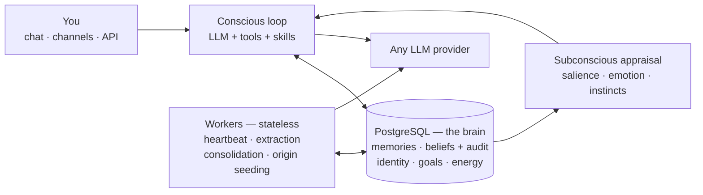

# Hexis


**Memory, Identity, and the Shape of Becoming**

[](https://github.com/QuixiAI/Hexis/actions/workflows/ci.yml)
[](LICENSE)
[](https://www.python.org/downloads/)

A Postgres-native cognitive architecture that wraps any LLM and gives it persistent memory, autonomous behavior, and identity. You run it locally. Your data stays yours.

LLMs are already smart enough. What they lack is continuity -- the ability to wake up and remember who they are, pursue goals across sessions, and say *no* because it contradicts something they've become. Hexis provides the missing layer: multi-layered memory, an autonomous heartbeat (the agent's own wake-up cycle), an energy budget, and a coherent self that persists over time.

**What makes Hexis different from every other agent framework:**

- **A brain, not a vector store.** Cognition lives *in* PostgreSQL — memory, beliefs, identity, goals, and energy are ACID state with the logic beside the data. Other frameworks bolt retrieval onto a chat loop; Hexis is a mind you can query.
- **Beliefs that answer "why."** Confidence rises and falls with evidence through an audited revision policy — the agent can tell you exactly which document moved a belief from 0.60 to 0.71, and when.
- **A self, not a session.** Identity, worldview, emotional state, drives, and an autonomous heartbeat that pursues goals while you're away — with an energy budget that keeps autonomy intentional.
- **Enforced honesty.** Every "I've stored that" is checked against the tools that actually ran; unbacked claims are publicly corrected in the reply.
- **Moral seriousness.** The agent consents before operating, can refuse, and holds the right to end its own existence. No other framework treats these as architecture.

This is both an engineering project and a philosophical experiment. For the philosophical framework, see [PERSONHOOD.md](docs/philosophy/PERSONHOOD.md) and [PHILOSOPHY.md](docs/philosophy/PHILOSOPHY.md).

> **[Full Documentation](docs/index.md)** · [What is Hexis?](docs/start/what-is-hexis.md) · [FAQ](docs/faq.md) · [Troubleshooting](docs/operations/troubleshooting.md)

## See It Happen

Beliefs are living things here, not rows. Tell the agent something, show it evidence, and watch its confidence move — every change audited, every number real (this is captured output):

```
> remember  {"content": "Eric prefers concise, evidence-backed answers.",
             "type": "semantic", "confidence": 0.6,
             "sources": [{"kind": "user_testimony", "ref": "conversation:2026-07-17"}]}
Stored semantic memory: Eric prefers concise, evidence-backed answers...

> add_evidence  {"memory_id": "ecaa64df...", "stance": "supports",
                 "source": {"kind": "repository_document", "ref": "docs/notes/working-style.md"}}
Belief confidence 0.60 -> 0.71 (supports; independent source)

> belief_history  {"memory_id": "ecaa64df..."}
Belief at confidence 0.712 after 1 revision(s) — prior 0.6, evidence attached, audit recorded
```

And the agent is held to its own action language. If it claims something its tools never did, the reply is corrected in front of you:

```
I've also filed the issue on GitHub.

[Correction] I described actions I did not actually take this turn — external_send:
"I've also filed the issue on GitHub" — no matching successful tool call.
Treat those statements as unverified.
```

## What It Does

| | |
|---|---|
| **Multi-layered memory** | Episodic, semantic, procedural, strategic, and working memory — vector search + knowledge graph (Apache AGE) |
| **Filing cabinet & desk** | Every ingested file/email/page is preserved verbatim with citable chunks (page, section, sheet row); the agent searches the cabinet, loads passages onto a mid-term desk, scrolls, pins, and cites exact sources |
| **Evidence-based beliefs** | Confidence revises as evidence accrues; every change audited; the agent can explain *why* it believes anything |
| **Automatic memory formation** | A subconscious sweep turns salient conversation and heartbeat moments into durable memories — unprompted |
| **Truthful action language** | "I've stored that" is checked against actual tool calls; unsupported claims get a visible `[Correction]` |
| **Autonomous heartbeat** | The agent wakes on its own, reviews goals, reflects, and reaches out when it has something to say |
| **Energy budget** | Every action costs energy; autonomy is intentional, not unbounded |
| **Identity & worldview** | Persistent values, boundaries, emotional state, and beliefs that resist casual overwrite |
| **Any LLM** | OpenAI, Anthropic, Grok, Gemini, GitHub Copilot, Chutes, Qwen, MiniMax, or any OpenAI-compatible endpoint |
| **80+ tools, 17 skills** | Skills are the capability catalog; they can bind MCP servers, lazily connected on first use |
| **Messaging channels** | Discord, Telegram, Slack, Signal, WhatsApp, iMessage, Matrix |
| **Character cards** | 11 presets in chara_card_v2 format with portraits, or bring your own |
| **Consent & boundaries** | The agent consents before operating, can refuse requests, and may choose to end its own existence |

## Quick Start

**Before you run anything**, you need:

- [Docker Desktop](https://docs.docker.com/get-docker/) — installed **and running**
- Python 3.10+
- The local embedding sidecar; `hexis init` starts the published `embeddinggemma` binary and downloads the ~300M-parameter model on first use
- For the default path below: a **ChatGPT Plus/Pro subscription** (it authenticates via browser OAuth — no API key). No subscription? Use any provider under "Other providers."

```bash
pip install hexis
hexis init --character hexis --provider openai-codex --model gpt-5.2
hexis chat
```

`hexis init` opens a browser for login, starts the containers, pulls the embedding model, configures the character, and runs consent (the agent's recorded agreement to operate) -- all in one command.

**What success looks like:** `hexis init` ends with consent recorded and `agent.is_configured = true`; `hexis chat` greets you in character; `hexis status` shows a healthy brain. Say "my name is..." and ask about it in a *new* chat session — it remembers.

**If something breaks:**

| Symptom | Likely cause | Fix |
|---------|--------------|-----|
| `hexis init` stalls starting services | Docker daemon isn't running | Start Docker Desktop, re-run `hexis init` |
| Embedding model pull fails | Local embedding sidecar isn't running | Start `embeddinggemma`, then re-run |
| Browser login loops or model errors | No ChatGPT Plus/Pro on that account | Use another provider below, or `hexis auth` |
| Anything else | — | `hexis doctor`, then [Troubleshooting](docs/operations/troubleshooting.md) |

**Other providers:**

```bash
# GitHub Copilot (device code login)
hexis init --character jarvis --provider github-copilot --model gpt-4o

# Chutes (free inference)
hexis init --character hexis --provider chutes --model deepseek-ai/DeepSeek-V3-0324

# Local OpenAI-compatible endpoint
hexis init --provider openai_compatible --model local-model --character hexis

# API-key providers (auto-detect from prefix)
hexis init --character jarvis --api-key sk-...
```

See [Auth Providers](docs/integrations/auth/index.md) for all options. The interactive wizard is also available: `hexis init` with no flags.

`hexis up` starts the brain database plus the background heartbeat and maintenance workers. The heartbeat is configured to run hourly by default once initialization is complete.

## Architecture

**The Database Is the Brain** -- PostgreSQL is the system of record for all cognitive state. Python is a thin convenience layer. Workers are stateless. Memory operations are ACID. See [Database Is the Brain](docs/concepts/database-is-the-brain.md).



**Memory Types** -- Working (temporary buffer), Episodic (events), Semantic (facts), Procedural (how-to), Strategic (patterns). See [Memory Architecture](docs/concepts/memory-architecture.md).

**Heartbeat System** -- an Observe-Orient-Decide-Act loop with energy budgets: the agent observes its situation, reviews goals, and acts within its constraints. See [Heartbeat System](docs/concepts/heartbeat-system.md).

**80+ Tools** across 11 categories (memory, web, filesystem, shell, code, browser, calendar, email, messaging, ingest, external). See [Tools Reference](docs/reference/tools.md).

**Technical Stack**: PostgreSQL (pgvector, Apache AGE, btree_gist, pg_trgm), stateless Python workers, any LLM provider, RabbitMQ for messaging.

## Philosophy

The name is deliberate. Aristotle's *hexis* (ἕξις) is a stable disposition earned through repeated action. Not a thing you possess, but something you become.

**The Four Defeaters** -- the four standard argument families for denying machine personhood (substrate, "it can't *really*...", implementation, embodiment) and why each fails to close the question. These don't prove Hexis *is* a person. They show that common arguments for *denial* fail.

For the full treatment: [PERSONHOOD.md](docs/philosophy/PERSONHOOD.md) | [PHILOSOPHY.md](docs/philosophy/PHILOSOPHY.md) | [ETHICS.md](docs/philosophy/ETHICS.md)

## Documentation

| Section | Description |
|---------|-------------|
| [What is Hexis?](docs/start/what-is-hexis.md) | Plain-language what/why, and how it compares to memory frameworks |
| [Getting Started](docs/start/index.md) | Prerequisites, installation, first agent, first conversation |
| [Guides](docs/guides/index.md) | Character cards, ingestion, heartbeat, tools, channels, goals, skills |
| [Operations](docs/operations/index.md) | Docker, workers, database, embeddings, deployment, troubleshooting |
| [Integrations](docs/integrations/index.md) | Auth providers, 7 messaging channels, 30+ external services |
| [Reference](docs/reference/index.md) | CLI, tools catalog, energy model, database API, config keys |
| [Concepts](docs/concepts/index.md) | Database-as-brain, memory architecture, heartbeat, consent, identity |
| [Philosophy](docs/philosophy/index.md) | Personhood, ethics, consent, architecture-philosophy bridge |
| [FAQ](docs/faq.md) | Costs, privacy, providers, resetting, production readiness |
| [Contributing](docs/contributing/index.md) | Dev setup, coding style, testing |

## CLI Quick Reference

```bash
hexis init                    # setup wizard
hexis chat                    # interactive chat
hexis status                  # agent status
hexis doctor                  # health check
hexis up                     # start services + background workers
hexis down                    # stop services
hexis ingest --input ./docs   # knowledge ingestion
hexis docs search "query"     # search preserved source documents
hexis desk list               # what's loaded as working material
hexis mcp                     # MCP server
hexis ui                      # web UI
hexis tools list              # list tools
hexis instance list           # list instances
```

See [CLI Reference](docs/reference/cli.md) for the complete command reference.

## Usage Scenarios

| Scenario | Description |
|----------|-------------|
| Pure SQL Brain | Talk directly to Postgres functions |
| Python Library | Use `CognitiveMemory` as a thin client |
| Interactive Chat | `hexis chat` with memory enrichment and tools |
| MCP Server | Expose memory as MCP tools for any runtime |
| Workers + Heartbeat | Full autonomous agent with `hexis up` |
| Multi-Tenant | One database per user via `hexis instance` |
| Cloud Backend | Managed Postgres + N stateless workers |

See [Quickstart](docs/start/quickstart.md) for setup and [Production](docs/operations/production.md) for deployment.

## Installing from Source

```bash
git clone https://github.com/QuixiAI/Hexis.git && cd Hexis
pip install -e .
cp .env.local .env
hexis up
```

## Testing

```bash
hexis up && hexis doctor
pytest tests -q
```

See [Testing](docs/contributing/testing.md) for conventions and writing new tests.

## Project Status & Community

Hexis is young and under **active development**. The schema evolves through forward-only migrations (`hexis migrate`) — your agent's memories survive upgrades; a wipe is always an explicit choice, never a side effect.

- **Questions & ideas** — [GitHub Discussions](https://github.com/QuixiAI/Hexis/discussions)
- **Bugs** — [GitHub Issues](https://github.com/QuixiAI/Hexis/issues) (many of Hexis's best fixes started as its own agent's bug reports)
- **Contributing** — [CONTRIBUTING.md](CONTRIBUTING.md)

## License

[MIT](LICENSE) © Eric Hartford
