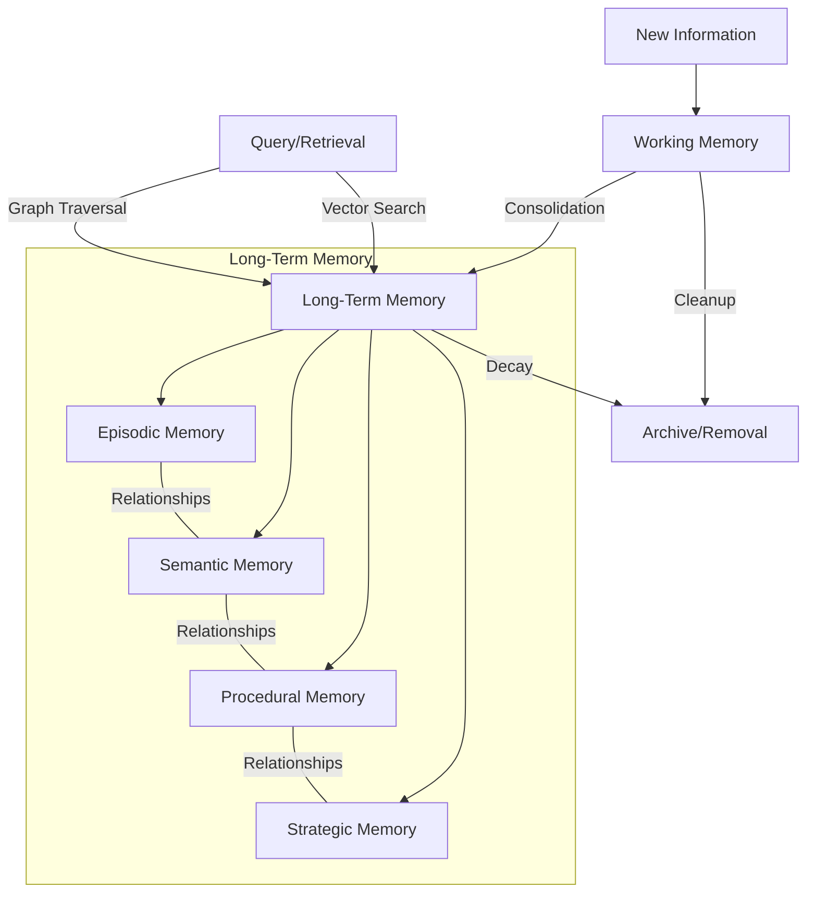

<!--
title: Memory Architecture
summary: Multi-layered memory system with vectors, graphs, and neighborhoods
read_when:
  - "You want to understand how memory works"
  - "You want to understand the retrieval system"
section: concepts
-->

# Memory Architecture

Hexis implements a multi-layered memory system modeled after cognitive science research.

## In Brief

Five memory types (working, episodic, semantic, procedural, strategic) with vector embeddings for similarity search, graph relationships for reasoning, and precomputed neighborhoods for fast retrieval.

## The Problem

Simple RAG systems store text chunks with embeddings and retrieve by similarity. This works for knowledge retrieval but fails to capture:

- **Temporal relationships** -- what happened before/after
- **Causal chains** -- what caused what
- **Contradictions** -- when new information conflicts with existing beliefs
- **Importance decay** -- not all memories are equally important over time
- **Associative recall** -- remembering one thing triggers related memories

## How Hexis Approaches It

### Memory Types

1. **Working Memory** -- temporary buffer (UNLOGGED table for fast writes). Information enters here first. Expires automatically; important items are promoted.

2. **Episodic Memory** -- events with temporal context, actions, results, and emotional valence. Forms the agent's autobiographical timeline.

3. **Semantic Memory** -- facts with confidence scores, structured source provenance, and evidence-based belief revision. New evidence moves a belief's confidence through a calibrated, audited policy (`add_evidence` / `revise_memory_confidence`): independent corroboration closes a fraction of the remaining doubt, contradiction erodes it symmetrically, and known sources never double-count. Every change is explainable from `belief_revision_audit`. The agent's knowledge base.

4. **Procedural Memory** -- step-by-step procedures with success rate tracking. How the agent knows how to do things.

5. **Strategic Memory** -- patterns with adaptation history. High-level strategies learned from experience.

### Memory Infrastructure

**Vector embeddings** (pgvector) provide similarity-based retrieval via HNSW indexes. The `get_embedding()` function handles generation and caching.

**Graph relationships** (Apache AGE) enable multi-hop traversal: `TEMPORAL_NEXT` for narrative sequence, `CAUSES` for causal reasoning, `CONTRADICTS` for dialectical tension, `SUPPORTS` for evidence chains.

**Automatic clustering** groups memories into thematic clusters with emotional signatures and centroid embeddings.

**Precomputed neighborhoods** store associative neighbor data for each memory, enabling spreading activation without real-time graph traversal.

**Full-text history search** uses PostgreSQL GIN indexes across raw RecMem turns
and consolidated memories. It provides a free lexical fallback for exact names
and phrases even before a turn has an embedding or while an embedding provider
is unavailable.

**Memory decay** reduces importance over time with importance-weighted persistence. Permanent memories (from important ingestion) are exempt, as are **protected memories** (`metadata.protected`) — notably the origin memories seeded at consent, whose trust is pinned and which contradicting evidence can question but never silently rewrite.

**Memory formation is layered**: explicit writes (`remember`), document ingestion, and the **conscious-episode extraction** sweep — a maintenance job that reviews recent chat turns and heartbeat episodes and selectively promotes salient facts into durable memory (an importance floor gates the LLM pass; routine content yields nothing; near-duplicates corroborate existing beliefs instead of piling up).

### Retrieval Model

Three performance tiers:

| Path | Method | Speed | Use Case |
|------|--------|-------|----------|
| **Lexical** | `search_cross_session_history` | Fast | Exact prior-turn or memory details without embeddings |
| **Hot** | `fast_recall` + neighborhoods + temporal | Fast | Primary retrieval |
| **Warm** | Cluster/episode lookups | Medium | Thematic search |
| **Cold** | Graph traversal (Apache AGE) | Slow | Multi-hop reasoning |

`fast_recall()` combines:
1. **Vector similarity** -- cosine distance on embeddings
2. **Neighborhood expansion** -- precomputed associative neighbors
3. **Temporal context** -- memories in the same episode get a boost

### Four Layers of Information Access

Distilled memories are one layer of a larger model. The agent works with
information the way a person works with a filing cabinet, a desk, and their
own recollection:

| Layer | What it holds | Lifetime |
|-------|---------------|----------|
| **Long-term memory** | Distilled, confidence-bearing facts and events (`memories`) | Permanent (decay/retention-managed) |
| **Filing cabinet** | Exact preserved sources — files, emails, pages — with citable chunks (`source_documents`, `source_document_chunks`, original bytes in `source_artifacts`) | Durable; user data never auto-fades |
| **RecMem desk** | Passages deliberately loaded for multi-step reasoning; searchable, scrollable, pinnable, GC'd when idle | Mid-term |
| **Current context** | The live prompt window | One turn |

The agent climbs a retrieval ladder across these layers: recall first, follow
provenance to the exact source when wording matters, search the cabinet
(passage-grain search is hybrid lexical + vector with inspectable rank
components), load onto the desk for sustained work, scroll rather than dump,
and cite exact handles — document, chunk, page, path.

### Worldview Integration

Beliefs (stored as worldview memories) filter and weight other memories. When new information contradicts existing beliefs, `CONTRADICTS` graph edges are created and the coherence drive is nudged upward to surface the tension. For semantic beliefs, contradiction also revises confidence through the audited belief-revision policy — except protected memories, where the contradiction is flagged for review but never applied.

## Key Design Decisions

- **Single `memories` table** -- all memory types share one table with JSONB metadata for type-specific fields. Simpler than a table-per-type approach.
- **Neighborhoods over real-time graph traversal** -- precomputed during maintenance for hot-path speed
- **Embeddings as DB implementation detail** -- application code never sees vectors
- **UNLOGGED working memory** -- fast writes since we can afford data loss (it's temporary)

## Implementation Pointers

- Tables: `db/*_tables_memory.sql`
- Functions: `db/*_functions_memory.sql`
- Neighborhoods: `db/*_functions_maintenance.sql`
- Belief revision: `db/59_belief_revision.sql` (policy + `belief_revision_audit`)
- Origin memories: `db/60_origin_memories.sql`
- Conscious-episode extraction: `db/61_functions_conscious_extraction.sql`, `services/extraction.py`
- Python client: `core/cognitive_memory_api.py`

## Related

- [Memory Types](../reference/memory-types.md) -- field-level reference
- [Memory Operations](../guides/memory-operations.md) -- practical usage
- [Database Is the Brain](database-is-the-brain.md) -- why memory is in Postgres
